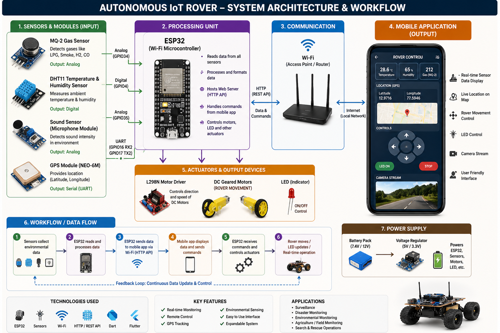
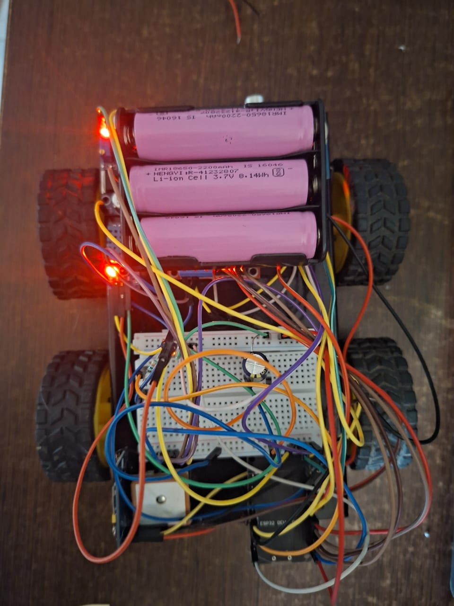
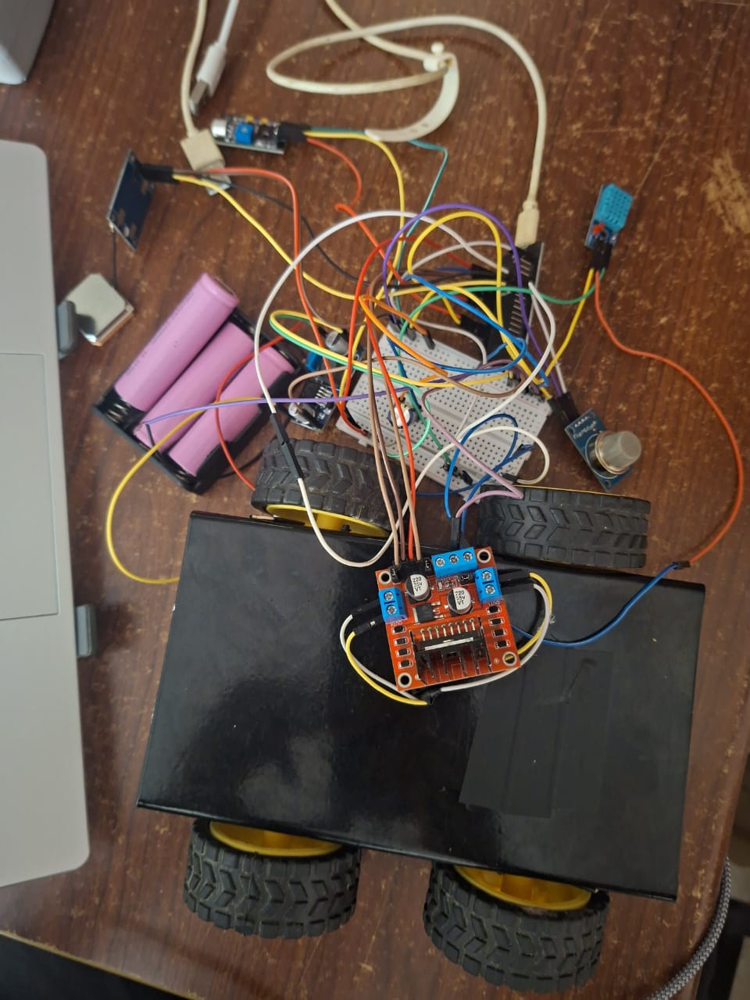
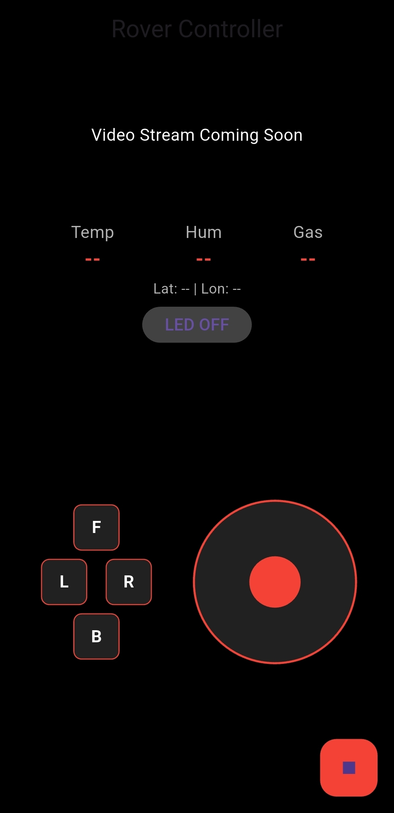
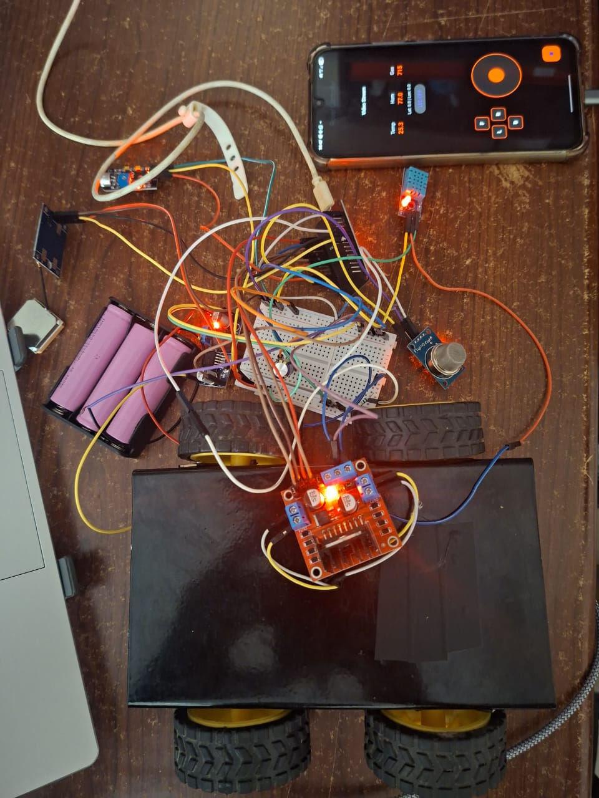

# HERA – Hazard Environment Rescue Assistant

An IoT-enabled rescue assistance rover designed for operation in hazardous and inaccessible environments. HERA enables rescue personnel to remotely navigate a rover while monitoring environmental conditions such as gas concentration, temperature, humidity, ambient sound, and geographical location through a Flutter-based mobile application.

---

## Project Overview

Hazardous environments such as disaster zones, collapsed structures, industrial accident sites, chemical leak areas, and fire-affected regions pose significant risks to rescue personnel.

HERA (Hazard Environment Rescue Assistant) is developed to provide remote situational awareness before human intervention. The system combines wireless rover navigation, environmental monitoring, GPS tracking, and real-time data visualization into a single platform.

The rover collects environmental data and transmits it over WiFi to a Flutter-based mobile application, allowing operators to assess site conditions remotely.

---

## Key Features

- Remote Rover Navigation
- GPS-Based Location Tracking
- Hazardous Gas Detection (MQ2)
- Temperature Monitoring (DHT11)
- Humidity Monitoring (DHT11)
- Sound Detection
- LED Illumination Control
- Emergency Stop System
- WiFi-Based Communication
- Real-Time Mobile Dashboard
- ESP32-CAM Streaming Interface Ready

---

## Hardware Components

| Component | Purpose |
|------------|----------|
| ESP32 Dev Module | Main Controller |
| MQ2 Gas Sensor | Gas Detection |
| DHT11 Sensor | Temperature & Humidity |
| Sound Sensor | Ambient Sound Monitoring |
| NEO-6M GPS Module | Location Tracking |
| L298N Motor Driver | Motor Control |
| DC Motors | Rover Locomotion |
| Buck Converter | Power Regulation |
| LED Module | Illumination |

---

## Software Stack

- Flutter
- Dart
- Arduino IDE
- ESP32 Web Server
- TinyGPS++
- DHT Sensor Library
- HTTP Communication

---

## System Architecture



---

## Hardware Prototype

### Rover Assembly



### Circuit Diagram



---

## Mobile Application



The Flutter application provides:

- Directional Rover Control
- Joystick-Based Navigation
- GPS Coordinates Display
- Gas Monitoring
- Temperature Monitoring
- Humidity Monitoring
- LED Control
- Emergency Stop Function

---

## Working Model



---

## Communication Workflow

```text
MQ2 Sensor
DHT11 Sensor
Sound Sensor
GPS Module
        │
        ▼
      ESP32
        │
        ├── Sensor Processing
        ├── GPS Processing
        ├── Motor Control
        ├── LED Control
        └── HTTP Server
        │
        ▼
     WiFi Network
        │
        ▼
 Flutter Mobile App
        │
        ├── Dashboard
        ├── GPS Tracking
        ├── Rover Controls
        ├── LED Controls
        └── Camera Interface
        │
        ▼
 Rescue Personnel
